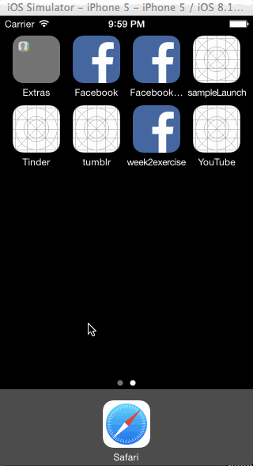

tumblr app

iOS app that demos the navigation flow of Tumblr.

Time spent: 4 hours

Completed user stories:

 * [x] Tapping on Home, Search, Account, or Trending should show the respective screen and highlight the tab bar button.
 * [x] Compose button should modally present the compose screen.
 * [x] Optional: Compose screen is faded in while the buttons animate in.
 
 Walkthrough:
 
 

GIF created with [LiceCap](http://www.cockos.com/licecap/).
